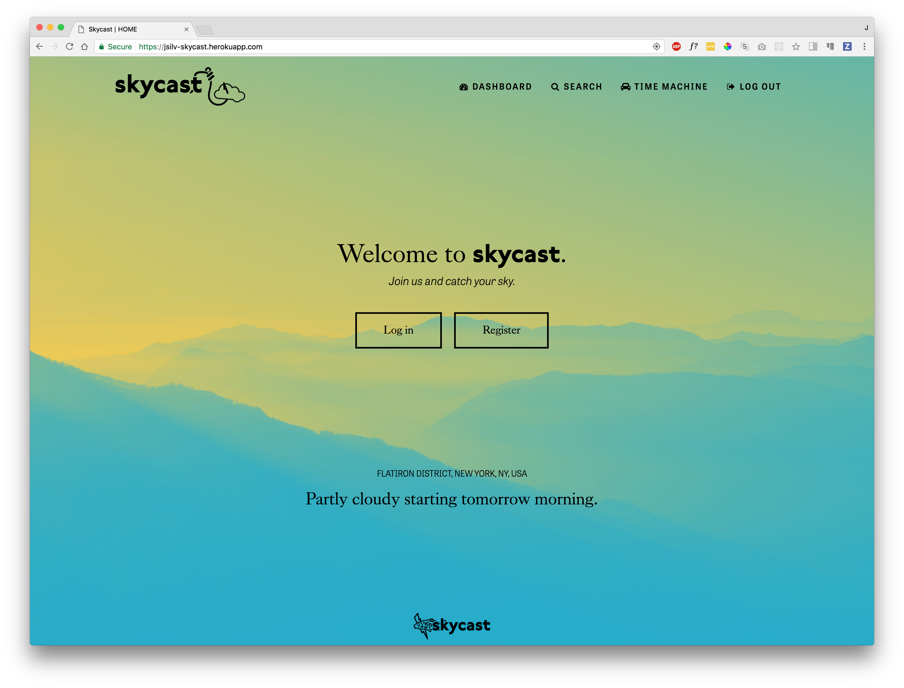

# Skycast

## [View Skycast live](https://jsilv-skycast.herokuapp.com/)



Skycast is a weather app that tracks a user's location and allows them to set a base home location which will render when they log in. It was created as a coding challenge.

### Installation Notes

To install Skycast locally, run `npm install` in the root directory.

You will also need to add the following variables to a `.env` file:

```
DATABASE_USERNAME=*your database username*
SECRET_KEY=*your secret key*
GOOGLE_MAPS_API=*your google maps api key*
FORECAST_API_KEY=*your https://darksky.net/dev/ api key*
```

### Directions for Future Development

I had a blast working on this -- I learned a lot, and I'm really looking forward to perfecting it. (I will probably keep tinkering with it over the coming days! Keep checking back if you want to see where it goes. ☺️) A couple of things I'd like to add:

- Ability for user to click on a search & redo the search
- Various UI bugs and oddities in the search and time machine sections of the site.
- Adding icons to the views
- Making the google and forecast handlers drier -- they do mostly the same thing. For the sake of time I left them like that, but there's surely some way that I can standardize them and boil them down to just one or two different functions.
- Deeper work into cross-browser performance and mobile display.
- Cleaner & clearer time machine result page
- I was looking at [this chart library](http://canvasjs.com/) and I think it would be a neat thing to include on the forecast
- Really nerd out that time machine page. I downloaded a neat little DeLorean icon...

### Technologies, APIs, and Credits

<dl>
<dt>Technologies</dt>
<dd>Skycast uses NodeJS and ExpressJS. It also uses MomentJS for formatting times and dates and axios to make both internal and external API calls.</dd>
<dt>APIs</dt>
<dd>Weather data is served using the <a href='https://darksky.net/dev/'>Dark Sky API</a>. Geolocation data comes from the built-in HTML5 property and the <a href='https://developers.google.com/maps/web-services/' target='_blank'>Google Web Services API</a>.</dd>
<dt>Credits</dt>
<dd>Icons are from various creators on <a href='http://thenounproject.com' target='_blank'>The Noun Project</a>, including Mungang Kim, T Com, Yu luck, ProSymbols, and icon 54.</dd>
</dl>